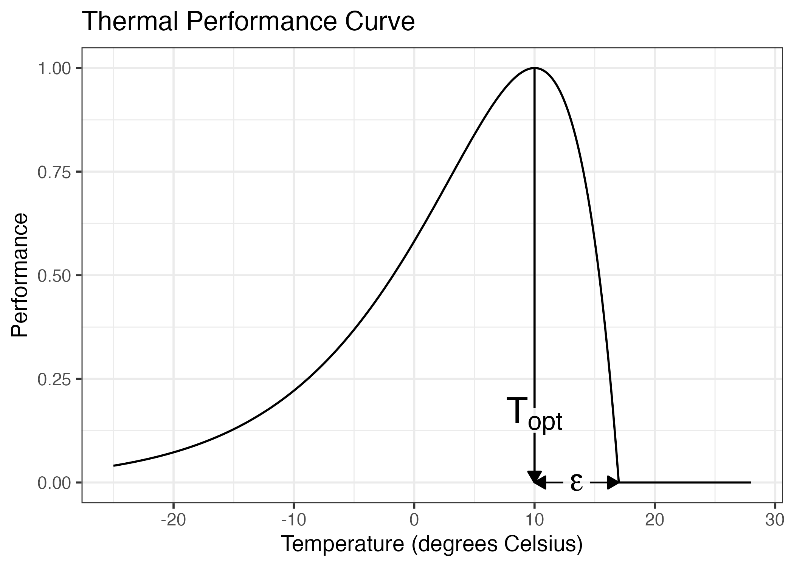
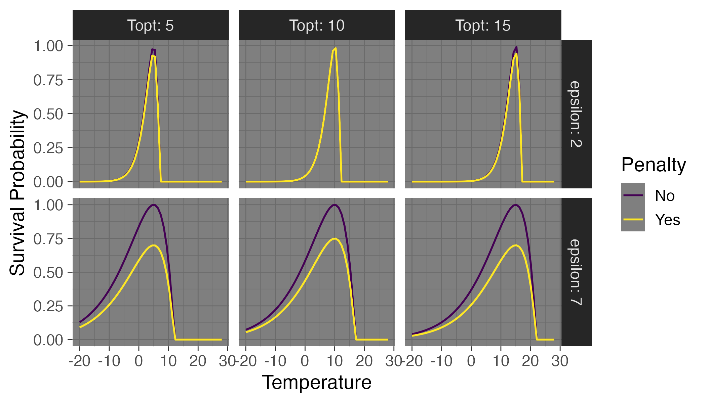
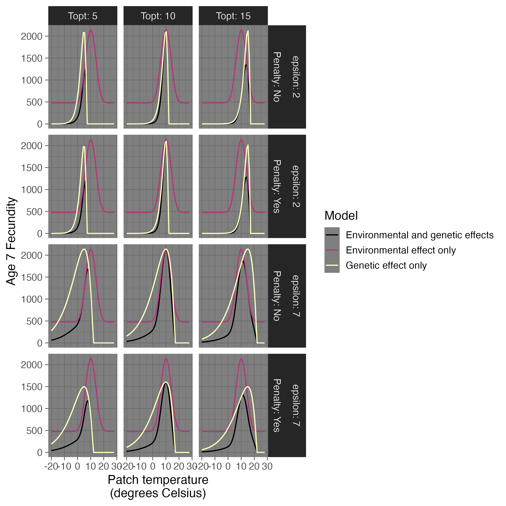
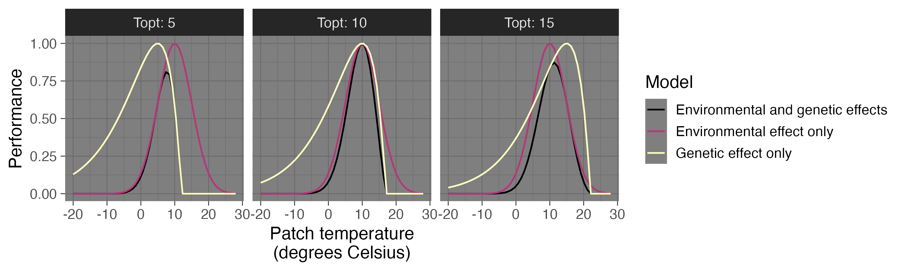

# CDMetaPOP Version 3S
Single species CDMetaPOP 3 with source code switched to SLiM for increased efficiency when implementing genetic models. Multi-species models are in progress. Models implemented and input file formats are identical to CDMetaPOP 3. For more info on these models, see the CDMetaPOP 3 documentation https://github.com/ComputationalEcologyLab/CDMetaPOP.

## How to install

Clone or download the CDMetaPOP_slim repository

```
git clone git@github.com:giliapatterson/CDMetaPOP_slim.git
```

Navigate to the folder containing the source code

```
cd CDMetaPOP_slim/CDMetaPOP_slim
```

Install the necessary packages using conda or mamba and activate the environment

```
conda env create -f environment.yml
conda activate cdmetapop_slim
```

or 

```
mamba env create -f environment.yml
mamba activate cdmetapop_slim
```

## How to run

- For the same behavior as CDMetaPOP3:

    ```
    python CDMetaPOP_slim.py -d ../example_runs/small_WCT_parameters/ -i RunVars_WCT.csv -o cdmetapop_slim_results_small
    ```

- To prevent CDMetaPOP from appending a timestamp to the end of the output folder:

    ```
    python CDMetaPOP_slim.py -d ../example_runs/small_WCT_parameters/ -i RunVars_WCT.csv -o cdmetapop_slim_results_small --no-filetime
    ```

- To set a random seed for reproducibility:

    ```
    python CDMetaPOP_slim.py -d ../example_runs/small_WCT_parameters/ -i RunVars_WCT.csv -o cdmetapop_slim_results_small --no-filetime -s 20329
    ```

    This option is very helpful for running on the cluster, because CDMetaPOP won't rerun replicates with the same seed. If some of the replicates don't finish due to time limits or out of memory errors, you can simply rerun the command with the same seed and CDMetaPOP will only rerun replicates that didn't finish the first time.

- To force rerunning simulations:

    ```
    python CDMetaPOP_slim.py -d ../example_runs/small_WCT_parameters/ -i RunVars_WCT.csv -o cdmetapop_slim_results_small --no-filetime -s 20329 --rerun
    ```

- To paralellize across replicates:

    ```
    python CDMetaPOP_slim.py -d ../example_runs/small_WCT_parameters/ -i RunVars_WCT.csv -o cdmetapop_slim_results_small --no-filetime -s 20329 --cores 20
    ```
    
    CDMetaPOP_slim will use as many cores as possible up to the number specified by `--cores`.

- To record tree sequences for use with [pyslim](https://tskit.dev/pyslim/docs/latest/overview.html):

    ```
    python CDMetaPOP_slim.py -d ../example_runs/small_WCT_parameters/ -i RunVars_WCT.csv -o cdmetapop_slim_results_small --no-filetime -s 20329 --cores 20 --treeseq
    ```

## Quantitative traits

### Model

CDMetaPOP SLiM allows users to model a quantitative trait linked to an environmental variable. In this model, an individuals phenotype is equal to
$$P_j = \sum_{h=1}^{2}\sum_{i=1}^{n}a_{ijh} + B + E_j$$
where $a_ijh$ is the phenotyic effect of the allele at locus $i$, on the $h^{th}$ copy of the genome of individual $j$, $B$ is the baseline phenotype, and $E_j$ is the additive effect of the environment for individual $j$. $E_j$ is drawn from a normal distribution with mean 0 and variance $V_E$. The baseline phenotype, $B$, is the mean value of the environmental variable specified in `qtl_env_variable` across all patches at the beginning of the simulation and does not change over time. The additive genetic variance of the trait is then
$$V_A = var\left(\sum_{h=1}^{2}\sum_{i=1}^{n}a_{ijh}\right)$$
and the heritability of the trait is $V_A/(V_E + V_A)$. This model does not include dominance or interactions between genotype and environment.

The default behavior is for the simulation to be initialized with no genetic variation and with a genome of length `genome_length`. At this point all individuals have the same phenotype, $B$. The user specifies the proportion of the genome where mutations that arise will affect the phenotype, `qtl_prop_genome`, as well as a mutation rate, `qtl_muterate`. When a new mutation arises in the quantitative trait portion of the genome, its phenotypic effect is drawn from the distribution of phenotypic effects specified by the user, `qtl_pheno_eff`. For example, if `qtl_pheno_eff = rnorm(1, 0, 5.0)`, then the phenotypic effect is drawn from a normal distribution with mean 0 and standard deviation 5.0. Mutations that arise in the remaining portion of the genome are neutral. The user also specifies a recombination rate for the genome, `qtl_recrate`. `qtl_muterate` and `qtl_recrate` can change over time, but `genome_length`, `qtl_prop_genome`, and `qtl_pheno_eff` cannot. 

Selection on the trait takes place immediately after dispersal, before the "Packing back" step. Selection takes place through excess mortality. The probability an individual dies in the selection step is determined by the deviation of its phenotype from the environment it experiences. The user specifies which environmental variable the phenotype is linked to in `qtl_env_variable`. `qtl_env_variable` must be the name of a column in the PatchVars file. The probability an individual dies is:
$$f((P_j-\text{environment experienced}))/f(0)$$
where $f$ is the PDF of a normal distribution with mean 0 and standard deviation $\sigma = $ `qtl_fit_sd`,

$$f(x) = \frac{1}{\sigma\sqrt{2\pi}} \exp\left( -\frac{1}{2}\left(\frac{x}{\sigma}\right)^{2}\right)$$


Users can change the way genotypes are initialized in two options.

1. Choose a genotype for each patch by specifying `qtl_loci_initial` and `qtl_dpe_initial` for each patch in PatchVars. `qtl_loci_initial` is the number of loci underlying the trait (e.g. 100) and `qtl_dpe_initial` is the distribution of effect sizes for those loci. (e.g. 'rep(1/200, 100)'). All individuals in the patch have the same initial genotype.

2. Specify `qtl_mutations_initial` in PopVars. If `qtl_mutations_initial` is specified, `qtl_mutations_initial` mutations are randomly added to the population with phenotypic effects drawn from `qtl_pheno_eff`.

If both options are used, the initial mutations will be added to the initial genotypes for each patch.


### Parameters

The parameters for the quantitative trait model are specified in PopVars and PatchVars and are summarized below:

In PopVars:

The structure of the genome can be specified two ways. 

1. Specify genome length, mutation rate, recombination rate separately.

    `genome_length`: The total number of base pairs in the simulated genome. Cannot change over time.

    `qtl_muterate`: Mutation rate. Can change over time, e.g. 1e-8|0.0|0.0.

    `qtl_recrate`: Recombination rate. Can change over time.

2. Specify a file containing length, recombination rate, and mutation rate for each chromosome in the genome.

    `genome`: Path to file. This file contains four columns: `Chromosome`, `Length`, `recombination_rate`, and `mutation_rate`. These parameters cannot change over time.


`qtl_prop_genome`: The proportion of the genome where new mutations influence phenotype. In the remainder of the genome, mutations are neutral. Cannot change over time.

`qtl_pheno_eff`: A piece of code for drawing the phenotypic effect of a new mutation. This code should return a single value. Any of the distribution functions from R will work, e.g. "rnorm(1, 0, 5.0)" or "rexp(1, 1)". So will sampling from a fixed set of phenotypic effects, e.g. "sample(c(-1, 0, 1), 1)". Cannot change over time.

`qtl_env_variable`: A column name in PatchVars. It can be either an existing column used for other parts of the model, such as GrowthTemperatureBack, or a new column used only for the quantitative trait model. The column name specified cannot change over time, but the value of the environmental variable can. Use PatchVars and cdclimgen to do this. In addition, if GrowthTemperatureBack or GrowthTemperatureOut are used and the standard deviation of GrowthTemperatureBack or GrowthTemperatureOut is not 0, then the value of the environmental variable will vary randomly year to year. 

`qtl_ve`: V_E. Can change over time.

`qtl_fit_sd`: Standard deviation of the normal distribution used to determine fitness. Can change over time.

`qtl_mutations_initial`: Number of initial mutations.

In PatchVars:

Setting the initial genotypes of every individual in the patch (optional). All individuals in a patch will have the same initial genotype.

`qtl_loci_initial`: Number of loci underlying trait (e.g. 100)

`qtl_dpe_initial`: Distribution of effect sizes for those loci. (e.g. 'rep(1/200, 100)').

### Output

If the quantitative trait model is used, CDMetaPOP_slim will output two additional files, QTL_overall.csv and QTL subpops.csv. These files contain:

`phenotypic_variance`: Total variance in phenotype.

`Va`: Additive genetic variance.

`Ve`: Environmental variance.

`heritability`: Equal to $V_A/(V_A + V_E)$.

`qtl_alleles`: Number of alleles that influence the quantitative trait.

`avg_effect_size`: Average phenotypic effect.

`neutral_pi`: Genetic diversity for only the neutral portion of the genome.

`overall_pi`: genetic diversity for the entire genome.

`qtl_environment`: Value of the environmental variable in a patch.

`avg_phenotype`: Average phenotype across all individuals in a patch.

## Thermal performance curves as quantitative traits

CDMetaPOP Version 3S includes support for modeling thermal performance curves as quantitative traits. The model is based on the universal thermal performance curve [[1](https://doi.org/10.1073/pnas.2513099122)]. The curve is specified by two parameters, $T_{opt}$ and $\epsilon$ and takes the form
$$P = \max(e^{x}(1-x), 0)$$
where $x = (t-T_{opt})/\epsilon$. $T_{opt}$ is the temperature in degrees Celsius at which an organism has an optimal performance of 1.0. As temperature increases, performance decreases to 0 at $CT_{max} = T_{opt} + \epsilon$. $\epsilon$ is known as the "thermal safety margin" [[2](ttps://doi.org/10.1111/ele.12686)].



$T_{opt}$ and $\epsilon$ are modeled as independent quantitative traits. Variants that affect $T_{opt}$ and $\epsilon$ are located in QTL regions distributed randomly across the genome. The user specifies the number and length of these regions, as well as the proportion of sites within each region where a mutation will affect either $T_{opt}$ or $\epsilon$. The rest of the sites are neutral. The mutation rate within neutral regions is set to 0. A user can overlay neutral mutations using tree sequences if needed. Mutations at half of the non-neutral sites in the genome influence $T_{opt}$ and mutations in the other half influence $\epsilon$. $T_{opt}$ for an individual $j$ is calculated as
$$T_{opt,j} = \sum_{h=1}^{2}\sum_{i \in T_{opt} \text{ sites}}a_{ijh} + B_{T_{opt}} + E_{T_{opt},j}$$
where $a_{ijh}$ is the phenotyic effect of the allele at locus $i$, on the $h^{th}$ copy of the genome of individual $j$, $B_{T_{opt}}$ is the baseline phenotype for $T_{opt}$, and $E_{T_{opt},j}$ is the additive effect of the environment on $T_{opt}$ for individual $j$. $E_{T_{opt},j}$ is drawn from a normal distribution with mean 0 and variance $V_{E, T_{opt}}$. 
$\epsilon$ for an individual $j$ is calculated similarly, with
$$\epsilon_{j} = \sum_{h=1}^{2}\sum_{i \in \epsilon \text{ sites}}a_{ijh} + B_{\epsilon} + E_{\epsilon,j}$$
where $B_{\epsilon}$ is the baseline phenotype for $\epsilon$ and $E_{\epsilon,j}$ is drawn from a normal distribution with mean 0 and variance $V_{E, \epsilon}$. 

The genome is initialized with no mutations and all individuals have $T_{opt} = B_{T_{opt}}$ and $\epsilon = B_{\epsilon}$. Mutations accumulate at the rate specified for each chromosome, introducing variation in thermal performance curves between individuals.

Because becoming more tolerant to hot or cold temperature can decrease an individuals overall performance, we also introduce a potential cost to increasing or decreasing $T_{opt}$ or $\epsilon$ by one degree Celsius from the baseline value. Cost is specified by the user. The cost scales the thermal performance curve by 
$$\max\left(0, 1 - |T_{opt} - B_{T_{opt}}|C_{T_{opt}} - |\epsilon - B_{\epsilon}|C_{\epsilon}\right).$$
When cost is not set to 0, individuals with very low or very high values of $T_{opt}$ or $\epsilon$ will have lower maximum performance.

The thermal performance curve influences fitness in two steps: fecundity and mortality. Mortality takes place immediately after dispersal and before density-dependent and age-dependent survival. An individual's probability of survival is the value of their thermal performance curve at the temperature they are currently experiencing. This temperature is `GrowthTemperatureBack` in their current patch.



For fecundity, the number of eggs produced by a female is multiplied by the value of her thermal performance curve at the temperature she is experiencing when she reproduces (`GrowthTemperatureBack` in here current patch.) In some CDMetaPOP models, fecundity is influenced by temperature through differences in growth rates at different temperatures (`sizecontrol = 'Y'`). This means that there are three options for modeling the effect of temperature on fecundity. The first is "Environmental only", when the thermal performance curve model is not operating and `sizecontrol = 'Y'`. In this model an individual's fecundity will depend only on the temperature in their patch, with no influence of genetics. The second is "Genetic only", when the thermal performance curve model is operating and `sizecontrol = 'N'`. In this model an individual's fecundity will depend on the interaction between genetics and environment throught $T_{opt}$ and $\epsilon$, but there is no independent effect of environment. The final is "Environmental and genetic", where an individual's fecundity depends both on the interaction between genetics and environment and on the independent effect of environment. Examples of these models are shown below.



### Parameters

The parameters for the thermal performance curve model are specified in RunVars and PopVars and are summarized below:

In PopVars:

`genome`: Path to file containing information on the genome. This file contains four columns: `Chromosome`, `Length`, `recombination_rate`, and `mutation_rate`. These parameters cannot change over time.

`qtl_regions`: Number of QTL regions in the genome. If the number specified cannot fit in the genome, the number of QTL regions will be reduced.

`qtl_region_length`: Length in base pairs of each QTL region.

`qtl_prop_region`: The proportion of QTL regions where new mutations influence phenotype. In the remainder of the genome, mutations are neutral. Half of the non-neutral sites influence $T_{opt}$ and half influence $\epsilon$. Cannot change over time.

`qtl_mutations_initial`: Number of mutations influencing $T_{opt}$ and $\epsilon$ to be added to each QTL region in the first generation.

`Topt_pheno_eff`: A piece of code for drawing the effect of a new mutation on $T_{opt}$. This code should return a single value. Any of the distribution functions from R will work, e.g. "rnorm(1, 0, 5.0)" or "rexp(1, 1)". So will sampling from a fixed set of phenotypic effects, e.g. "sample(c(-1, 0, 1), 1)".

`epsilon_pheno_eff`: A piece of code for drawing the effect of a new mutation on $\epsilon$.

`Topt_ve`: V_E for $T_{opt}$.

`epsilon_ve`: V_E for $\epsilon$. 

`Topt_baseline`: Value of $T_{opt}$ when no mutations influencing $T_{opt}$ are present.

`epsilon_baseline`: Value of $\epsilon$ when no mutations influencing $\epsilon$ are present.

`Topt_cost`: Cost of changing $T_{opt}$ by 1 degree Celsius from `Topt_baseline`.

`epsilon_cost`: Cost of changing $\epsilon$ by 1 degree Celsius from `epsilon_baseline`.

In RunVars:

`mutation_output_years`: Years in which to output information about all mutations in a chosen subset of patches. Years should be separated by "|" and 0 indexed, e.g. "0|10|20".

`mutation_output_subpops`: Patch IDs for chosen subset of patches. Should correspond to the `PatchID` column in PatchVars and be separated by "|", e.g. "0|1|2|3|4|5".

`mutation_origin_year`: Year to record frequencies of each mutation in each patch.

Optional independent temperature effect, specified in PopVars:

`independent_environment_mean`, `independent_environment_sd`: Parameters of a normal distribution for the independent effect of temperature on performance. The figure below shows examples of thermal performance curves for `independent_environment_mean` = 10, `independent_environment_sd` = 5, and `epsilon` = 7.



### Output

As for the quantitative trait model, CDMetaPOP_slim will output two additional files, QTL_overall.csv and QTL subpops.csv. These files contain the same information as for the quantitative trait model, but separated by $T_{opt}$ and $\epsilon$.

CDMetaPOP_slim will also output an additional file, `mutation_origins.csv `, that allows a user to track where adaptive variation is arising. For each year specified in RunVars, and for each of the focal patches specified in RunVars, this file will contain information on the origin of all mutations in the patch. The columns in this file include:

`tick`: Year

`subpop`: Focal patch

`origin_subpop`: Source patch

`Topt_count`: Number of mutations in the focal patch influencing $T_{opt}$ that originated in the source patch.

`epsilon_count`: Number of mutations in the focal patch influencing $\epsilon$ that originated in the source patch.

`neutral_count`: Number of neutral mutations in the focal patch that originated in the source patch.

`Topt_mean_contribution`: Mean contribution to $T_{opt}$ of mutations in the focal patch that originated in the source patch.

`epsilon_mean_contribution`: Mean contribution to $\epsilon$ of mutations in the focal patch that originated in the source patch.

`Topt_VA`: Additive genetic variance of mutations influencing $T_{opt}$ in the focal patch that originated in the source patch.

`epsilon_VA`: : Additive genetic variance of mutations influencing $\epsilon$ in the focal patch that originated in the source patch.

Information on all mutations will be recorded in the file `mutation_effects.csv`. The columns of this file are:

`tick`: Current year

`substitution`: Is the mutation fixed in the population?

`phenotype`: Trait affected by the mutation. $T_{opt}$ or $\epsilon$

`effect`: Effect of the mutation on phenotype

`frequency`: Frequency of the mutation in the population.

`count`: Number of copies of the mutation in the population.

`id`: Number that identifies this mutation. ID is consistent throughout the simulation and uniquely identifies mutations.

### References for thermal performance curve model

1. Arnoldi J-F, Jackson AL, Peralta-Maraver I, Payne NL. A universal thermal performance curve arises in biology and ecology. Proc Natl Acad Sci USA. 2025;122:e2513099122. https://doi.org/10.1073/pnas.2513099122.

2. Sinclair BJ, Marshall KE, Sewell MA, Levesque DL, Willett CS, Slotsbo S, et al. Can we predict ectotherm responses to climate change using thermal performance curves and body temperatures? Ecology Letters. 2016;19:1372–85. https://doi.org/10.1111/ele.12686.


## Example runs

### Modeling thermal optimum as a quantitative trait

```
example_runs/climate_change_McKenzie
```

This example models the evolution of thermal tolerance as the climate warms. The example folder contains a bash script, `run_and_plot.sh` that generates the input files for CDMetaPOP_slim, runs the simulations, and plots population sizes, phenotypes, heritability, and genetic diversity over time. The resulting plots will be in the folder `example_runs/climate_change_McKenzie/qtl_plots`.

To run the script, navigate to the `example_runs` directory (`cd example_runs`), then run the bash script:

```
bash climate_change_McKenzie/run_and_plot.sh
```

### Modeling a genome with 32 chromosomes and thermal optimum as a quantitative trait

```
example_runs/trout_genome
```

This example runs the same model of evolution of thermal tolerance as the climate warms as above, but on a genome with 32 chromosomes. The genome is modeled after the Westslope cutthroat trout genome [[1](https://doi.org/10.1093/g3journal/jkaf064)], excluding the sex chromosomes. 

To run the script, navigate to the `example_runs/trout_genome` directory and run:

```
python ../../CDMetaPOP_slim/CDmetaPOP_slim.py -c8 -d climate_change_McKenzie -i RunVars.csv -o slim_output --no-filetime -s 300
```

1. Flores A-M, Christensen KA, Godin T, Palti Y, Campbell MR, Waldbieser GC, et al. The genome assembly of the westslope cutthroat trout, Oncorhynchus lewisi , reveals interspecific chromosomal rearrangements with the rainbow trout, Oncorhynchus mykiss. G3: Genes, Genomes, Genetics. 2025;15:jkaf064. https://doi.org/10.1093/g3journal/jkaf064.

### Modeling evolution of thermal performance curves

```
example_runs/trout_genome/thermal_performance
```

This example runs on the same 32 chromosome Westslope cutthroat trout genome as above. 

To run the script, navigate to the `example_runs/trout_genome/thermal_performance` directory and run:

```
bash run_and_plot.sh
```

### Modeling evolution of thermal performance curves with an independent temperature effect and plotting the origin of adaptive mutations

```
example_runs/evolution_of_tpc
```

To run the script, navigate to the `example_runs/evolution_of_tpc` directory and run:

```
bash run_and_plot.sh
```

### Coastal cutthroat trout in the McKenzie

```
example_runs/McKenzie_CCT
```

Random initialization of 100 loci.

```
python CDMetaPOP_slim.py -d ../example_runs/McKenzie_CCT/ -i RunVars.csv -o cdmetapop_slim_results --no-filetime -s 233
```

Runtime: ~24 seconds in CDMetaPOP Version 3S, ~12 minutes in CDMetaPOP Version 3

### Westslope cutthroat trout - small version

```
example_runs/small_WCT_parameters
```

5 patches, genes initialized from file, climate changes over time, 5 runs of each set of parameters.

```
python CDMetaPOP_slim.py -d ../example_runs/small_WCT_parameters/ -i RunVars_WCT.csv -o cdmetapop_slim_results_small --no-filetime -s 20329 --cores 1
```

Runtime: With no parallelization, ~10 minutes in CDMetaPOP Version 3S, ~124 minutes in CDMetaPOP Version 3.

### Westslope cutthroat trout - big version

```
example_runs/WCT_parameters
```

415 patches, genes initialized from file, climate changes over time, 5 runs of each set of parameters.

```
python CDMetaPOP_slim.py -d ../example_runs/WCT_parameters/ -i RunVars_WCT.csv -o cdmetapop_slim_results --no-filetime -s 20329 --cores 8
```

Runtime: Parallelized over 8 cores: ~216 minutes in CDMetaPOP Version 3S


